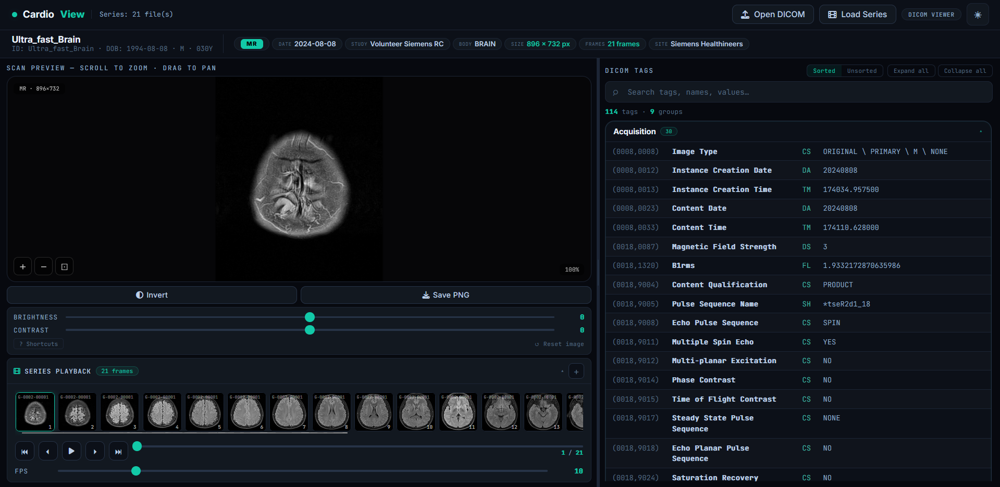
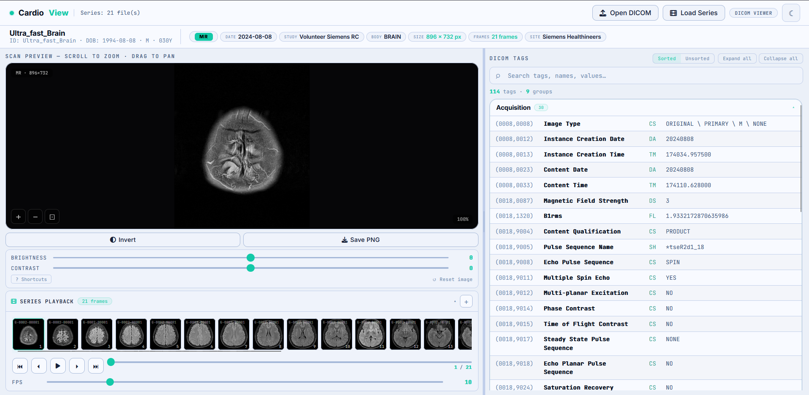

# CardioView

A browser-based DICOM viewer built with Flask and vanilla JS. Drag in a `.dcm` file and it renders the image, parses every tag, and lets you scrub through multi-frame series — no PACS, no plugins, nothing leaving your machine.



---

## Features

**Viewer**
- Canvas rendering with scroll-to-zoom, drag-to-pan, and pinch-to-zoom on touch
- Brightness and contrast sliders, invert toggle
- Built-in clinical W/L presets: Brain, Subdural, Stroke, Lung, Bone, Liver, Soft Tissue, Vascular, and more
- Pan minimap — appears in the corner when zoomed in so you don't lose your place
- Save current view as PNG (filters included)
- Resizable image / tag panel divider
- Dark and light theme toggle

**Series playback**
- Load multiple files at once — sorted by `InstanceNumber` then `SliceLocation` server-side
- Filmstrip thumbnail strip with click-to-seek
- Play/pause with adjustable FPS (1–60)
- First / prev / next / last controls and a scrubber
- Append more files to an existing series without clearing it
- Drag multiple files directly onto the viewer to load as series

**Tag browser**
- Every tag grouped by category: Patient, Study, Series, Equipment, Image, CT, MR, Cardiac, NM/PET, etc.
- Sorted view (grouped) or unsorted view (raw file order)
- Full-text search across tag IDs, names, keywords, and values with match highlighting
- Collapsible sequence (SQ) items with nested child tags
- Expand all / collapse all

**General**
- Patient banner: name, ID, DOB, sex, age, modality, study date, dimensions, frame count, institution
- Responsive layout — stacks vertically on narrow screens
- Keyboard shortcuts overlay (press `?` in the viewer)

---

## Tech stack

| Layer    | Technology |
|----------|------------|
| Backend  | Python 3 · Flask · pydicom · NumPy · Pillow |
| Frontend | Vanilla JS · Canvas API · HTML5 / CSS3 |
| Fonts    | JetBrains Mono · Inter (Google Fonts) |
| Icons    | Font Awesome 6 |

---

## Installation

### 1. Clone the repo

```bash
git clone https://github.com/your-username/cardioview.git
cd cardioview
```

### 2. Create a virtual environment

```bash
python -m venv .venv
source .venv/bin/activate   # Windows: .venv\Scripts\activate
```

### 3. Install dependencies

```bash
pip install -r requirements.txt
```

### 4. Place the frontend

```bash
mkdir -p static
cp index.html static/index.html
```

### 5. Run

```bash
python app.py
```

Open **http://localhost:5000**.

For production, use a real WSGI server instead of Flask's dev server:

```bash
pip install waitress
waitress-serve --port=5000 app:app
```

---

## Usage

### Single file

Drag a `.dcm` file onto the drop zone (or click to browse). The image renders with DICOM windowing applied automatically. Use the **Brightness** and **Contrast** sliders to adjust, **Invert** to flip polarity, and **Save PNG** to download the current view.

### Series / animation

1. Drop multiple DICOM files onto the drop zone, or use **Load Series** in the header, or click the **+** button in the Series Playback panel to append files to an existing series.
2. Files are parsed and sorted server-side. All frames are extracted — including multi-frame DICOMs — and returned as a flat ordered sequence.
3. A filmstrip of thumbnails appears. Click any thumbnail to jump to that frame.
4. Use the transport controls (**⏮ ⏴ ▶ ⏵ ⏭**) or the scrubber to navigate. Adjust FPS to change playback speed.

> **CT tip:** Select all `.dcm` files for a study at once (Ctrl+A). CardioView sorts by instance number so the stack plays in the correct anatomical order.

### Tag explorer

The right panel shows every tag in the file. Search by tag address, keyword, name, or value. Nested sequences are expandable. Toggle between **Sorted** (grouped by category) and **Unsorted** (raw file order) views.

---

## Keyboard shortcuts

| Key | Action |
|-----|--------|
| `Scroll` | Zoom in / out |
| `Drag` | Pan image |
| `Pinch` | Zoom (touch) |
| `R` | Reset image (zoom, pan, filters) |
| `←` / `→` | Previous / next frame |
| `Space` | Play / pause series |
| `Esc` | Close shortcuts overlay |
| `?` | Show shortcuts overlay |

---

## API

Both endpoints accept `multipart/form-data`.

### `POST /api/parse`

Single file.

**Request:** `file` — one `.dcm` file

**Response:**
```json
{
  "ok": true,
  "filename": "scan.dcm",
  "summary": { "patientName": "...", "modality": "CT", "rows": "512", ... },
  "tagGroups": { "Patient": [...], "CT": [...] },
  "totalTags": 142,
  "image": "<base64 PNG>",
  "imageError": null
}
```

### `POST /api/parse_series`

Multiple files. Sorted by `InstanceNumber` then `SliceLocation` before processing.

**Request:** `files` — one or more `.dcm` files

**Response:**
```json
{
  "ok": true,
  "totalFrames": 64,
  "frames": [
    { "filename": "IM001.dcm", "frameIndex": 0, "image": "<base64 PNG>" }
  ],
  "summary": { ... },
  "tagGroups": { ... },
  "totalTags": 142,
  "errors": []
}
```

Partial success is fine — failed files appear in `errors`, the rest still load.

---

## Project structure

```
cardioview/
├── app.py              # Flask backend — parsing, windowing, series API
├── requirements.txt
├── static/
│   └── index.html      # Entire frontend — viewer, tag browser, series player
└── README.md
```

No build step. Everything frontend is a single self-contained HTML file.

---

## Supported DICOM types

| Type | Notes |
|------|-------|
| CT | Full WC/WW windowing applied |
| MR | Auto-normalized if no window tags present |
| X-Ray / CR / DX | Monochrome and RGB |
| NM / PET | Frame extraction supported |
| Multi-frame DICOM | All frames extracted from a single file |
| JPEG Lossless (Process 14) | Handled via pylibjpeg |
| JPEG 2000 | Requires `pylibjpeg-openjpeg` |
| RLE Lossless | Built into pydicom |

---

## Known limitations

- All frames are base64-encoded in a single response — large series (500+ frames) will be slow
- No DICOMDIR or WADO-RS support (plain file upload only)
- No authentication — built for local or trusted network use
- CORS is open (`*`) — restrict it before deploying anywhere public
- Not intended for clinical diagnostic use

---

## Contributing

Pull requests are welcome. For major changes please open an issue first.

---

## License

MIT